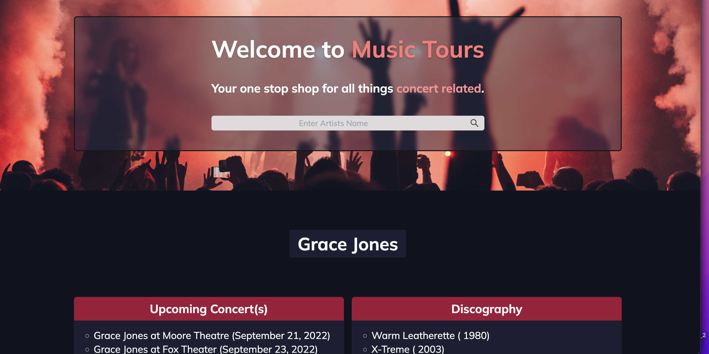
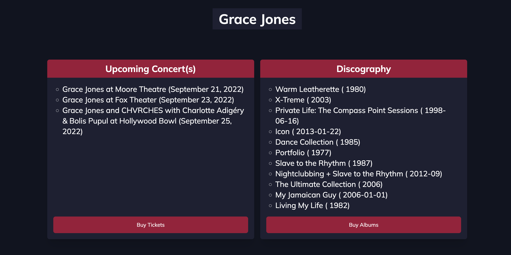

### User Story

As a user I am looking for a resource that will provide me some information about my favorite music artists. When I load the application I would like eneter an artists name and be presented with the following: Any current tour dates, a discography list, and some youtube content. 
I would also like the option to be able to buy tickets or albums by the artist searched.

### Features
This web application uses multiple API searches to provide the user with information about their favorite artists.
When you search an artists name you will be provided a list of current upcoming tour dates.
You can click the button below that section to be routed to a website where you can buy tickets.
The search will also return some of the artists' discography.
You can click the button below that section and you will be taken to teh amazon seach page for that Artists' available albums.
The initial search also returns youtube content that can be opened and viewed in another window.
There is also a search history logged at the bottom so you can quickly view a past Artist seacrh.

<<<<<<< HEAD
## Technologies Used:
- HTML
- CSS
- JS
- Tailwind
- YouTube API
- SongKick API
- MusicBrainz API
- Imsea API

In order to achieve these requirements, we needed to ensure the following was completed:
=======
>>>>>>> develop

### badges

## Table of Contents

- [installation](#installation)
- [contribution guidelines](#contribution)
- [Test Instructions](#testing)
- [License](#license)
- [Questions](#questions)

### Installation
Please clone the github repo here :
https://github.com/Vinyldude8896/Artist_Music_Tour

#### Install Dependencies
This does not require installation of any dependencies.

#### Run the program
Right click on the index.html page and run in live server or default browser.

You can also view the live page here:  
https://vinyldude8896.github.io/Artist_Music_Tour/

### Contribution Guidelines
Current contributers:
Arslan Tahir: https://github.com/tahir-arslan  
Kevin Reid : https://github.com/Vinyldude8896  
Kevin Knight: https://github.com/ksknight81  
Etienne Rodriguez : https://github.com/tienrdrz  
Leonel Pinzon: https://github.com/Leman102  

### Testing
To test this app: 
1. Clone the repo here : https://github.com/Vinyldude8896/Artist_Music_Tour.  
2. Open the index.html file in live server or in default browser.  
3. Try searching for an artist  
4. Check the but tickets option  
5. check the buy albums option  
6. check your previous search history reults at the bottom  

### Questions
    email address : kevinnivek@me.com
    - additional instructions 
    I can be contacted by phone as well, but prefer email contact first.

### Images of example readme.md

